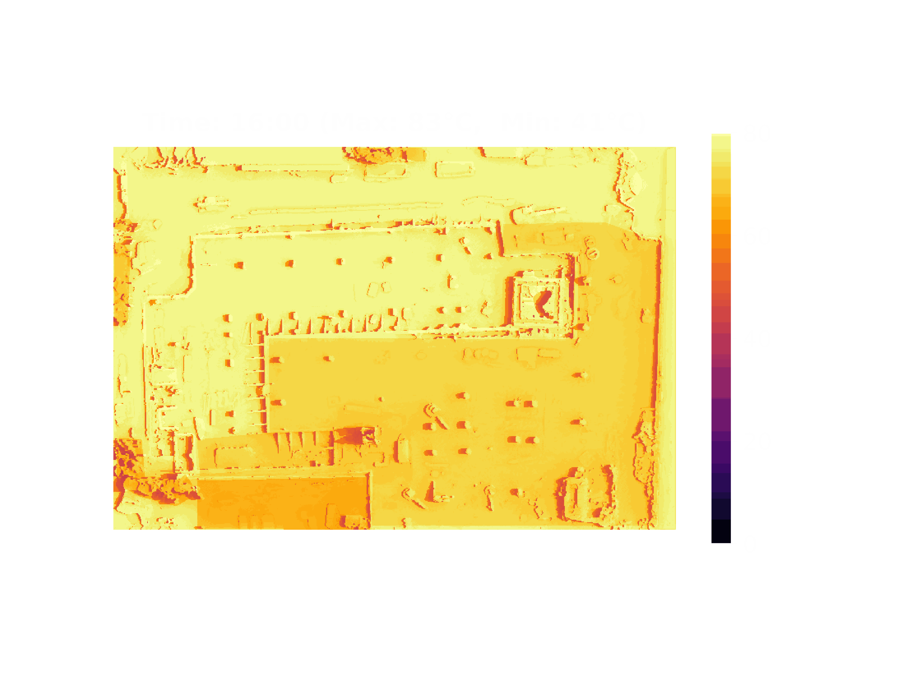

# Img2GIF
Convert images to Graphics Interchange Format (GIF) in Python

| Img                                                   | GIF                                           |
| ----------------------------------------------------- | --------------------------------------------- |
|  |  |
